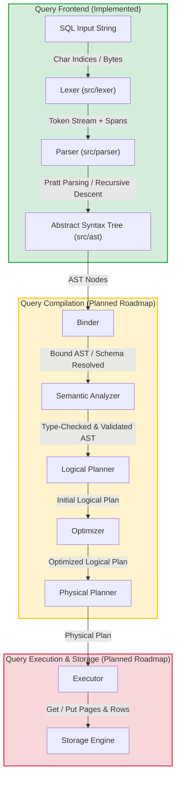

# OsirisDB

[](https://crates.io/crates/osirisdb)
[](LICENSE)
[](https://github.com/musab05/osirisdb/actions)

> [!WARNING]
> **Project Status**: OsirisDB is currently under active development and is not yet ready for production use. APIs and interfaces are subject to change before the first stable release on crates.io.

A modular SQL database engine implemented in Rust, featuring a custom parser, binder, query planner, optimizer, catalog, and storage engine. It compiles raw SQL query strings into a fully typed Abstract Syntax Tree (AST) resembling PostgreSQL syntax.

This project is built from scratch to provide a clean, extensible foundation for SQL parsing, query analysis, and database engine implementation.

## Features

- **Hand-written Lexer**: Fast, zero-copy byte-level tokenizer with position tracking (line and column numbers) for precise error locations.
- **Pratt Parser for Expressions**: Uses Top-Down Operator Precedence (Pratt parsing) for handling complex SQL expressions, nested operators, functions, and casts with correct precedence.
- **PostgreSQL Compatibility**:
  - DDL: `CREATE TABLE` (including column constraints, default values, checks, generated columns, foreign keys, partition by, inherits, tablespaces), `CREATE INDEX`, `CREATE VIEW`, `CREATE SCHEMA`, `CREATE SEQUENCE`, `DROP`, `TRUNCATE`.
  - DML: `SELECT` (including joins, subqueries, group by, having, CTEs/with, order by, window functions, set operations like UNION/INTERSECT/EXCEPT).
  - Basic transaction control statements (`BEGIN`, `COMMIT`, `ROLLBACK`).
- **Trait-based Extensible Architecture**: The parser is split into logical modules via extension traits, making it easy to add new statement parsers.

## Architecture



### Query Execution Lifecycle

The system is designed around a classic 11-stage query compilation and execution pipeline:

| Phase | Path / Status | Description |
| :--- | :--- | :--- |
| **1. SQL Input** | Input | Raw query string submitted by the user or client application. |
| **2. Lexer** | [`src/lexer/`](src/lexer/) (Implemented) | Zero-copy lexical analyzer. Splits input characters into distinct tokens with precise `Span` locations. |
| **3. Parser** | [`src/parser/`](src/parser/) (Implemented) | Hand-written recursive descent and Pratt parser. Converts tokens into structured syntax elements. |
| **4. AST** | [`src/ast/`](src/ast/) (Implemented) | Strongly-typed Abstract Syntax Tree representing the statements (DDL/DML/Queries) and expressions. |
| **5. Binder** | [`src/binder/`](src/binder/) (Implemented) | Resolves identifiers (tables, columns, views) against the catalog schema, matches functions, and produces a bound AST. |
| **6. Semantic Analyzer**| Planned | Validates semantic rules (e.g. correct usage of window and aggregate functions, type safety, user privileges). |
| **7. Logical Planner** | Planned | Translates the bound AST into a tree of relational algebra operators (e.g. Scan, Filter, Project, Join, Limit). |
| **8. Optimizer** | Planned | Rewrites logical plans using rule-based transformations (predicate pushdown) and cost-based plan searches. |
| **9. Physical Planner**| Planned | Translates the logical plan into a tree of concrete physical execution operators (e.g. HashJoin, IndexScan, SeqScan). |
| **10. Executor** | [`src/executor/`](src/executor/) (Implemented) | Receives bound statements and applies them to the catalog and storage. Currently executes database DDL statements. |
| **11. Storage Engine**| [`src/storage/`](src/storage/) (Implemented) | Manages on-disk layout, directories, and files. Currently supports directory creation and drop operations for databases and schemas. |

## Quick Start

Add `osirisdb` to your `Cargo.toml`:

```toml
[dependencies]
osirisdb = { git = "https://github.com/musab05/osirisdb.git" }
```

### Usage Example

```rust
use osirisdb::parser::Parser;

fn main() {
    let sql = "SELECT id, name FROM users WHERE age >= 18 ORDER BY name ASC;";
    let mut parser = Parser::new(sql);

    match parser.parse() {
        Ok(statements) => {
            for stmt in statements {
                println!("{:#?}", stmt);
            }
        }
        Err(err) => {
            eprintln!("Parse error: {} at line {}, col {}", err.message, err.span.line, err.span.column);
        }
    }
}
```

## Supported Statements & Syntax

### Query Syntax (SELECT)
- Column aliases and wildcards (`SELECT a AS b, tbl.*`)
- Table Joins (`INNER`, `LEFT/RIGHT/FULL OUTER`, `CROSS`, `NATURAL`)
- Filtering and Aggregation (`WHERE`, `GROUP BY`, `HAVING`)
- CTEs / Subqueries (`WITH active_users AS (SELECT ...) SELECT ...`)
- Ordering & Pagination (`ORDER BY col DESC NULLS LAST LIMIT 10 OFFSET 5`)
- Set operations (`UNION [ALL]`, `INTERSECT [ALL]`, `EXCEPT [ALL]`)

### DDL Syntax
- `CREATE [TEMP] TABLE [IF NOT EXISTS] name (columns...)`
- `CREATE [UNIQUE] INDEX [IF NOT EXISTS] name ON table (...)`
- `CREATE [OR REPLACE] [TEMP] [RECURSIVE] VIEW name AS select`
- `CREATE SCHEMA [IF NOT EXISTS] name`
- `CREATE SEQUENCE [IF NOT EXISTS] name`
- `DROP TABLE [IF EXISTS] names... [CASCADE | RESTRICT]`
- `TRUNCATE [TABLE] names... [RESTART IDENTITY] [CASCADE | RESTRICT]`

## Project Structure

- [`src/lexer/`](src/lexer/): Hand-written lexical analyzer (tokenizer).
  - [`lexer.rs`](src/lexer/lexer.rs): Core tokenizer loop and char readers.
  - [`token.rs`](src/lexer/token.rs): Token classifications and Span representation.
- [`src/ast/`](src/ast/): Struct and Enum definitions representing the SQL syntax trees.
  - [`statement.rs`](src/ast/statement.rs): Main `Statement` enum.
  - [`expression/`](src/ast/expression/): Operator and expression nodes (`Expr`).
- [`src/parser/`](src/parser/): Pratt & Recursive-descent parser implementation.
  - [`parser.rs`](src/parser/parser.rs): Main Parser shell.
  - [`expression.rs`](src/parser/expression.rs): Pratt expression parser.
  - [`table.rs`](src/parser/table.rs): `CREATE TABLE` and table constraint parser.
- [`src/binder/`](src/binder/): Name binding and query compilation. Maps the raw AST into a strongly typed, resolved AST.
- [`src/catalog/`](src/catalog/): The system catalog metadata manager, tracking databases, schemas, tables, and roles.
- [`src/executor/`](src/executor/): Volcano-style iterator model execution engine, currently executing DDL statements.
- [`src/storage/`](src/storage/): The disk storage engine. Manages layout, file storage, database folders, and schemas on disk.

## License

This project is licensed under the Apache License, Version 2.0. See the [LICENSE](LICENSE) file for details.
