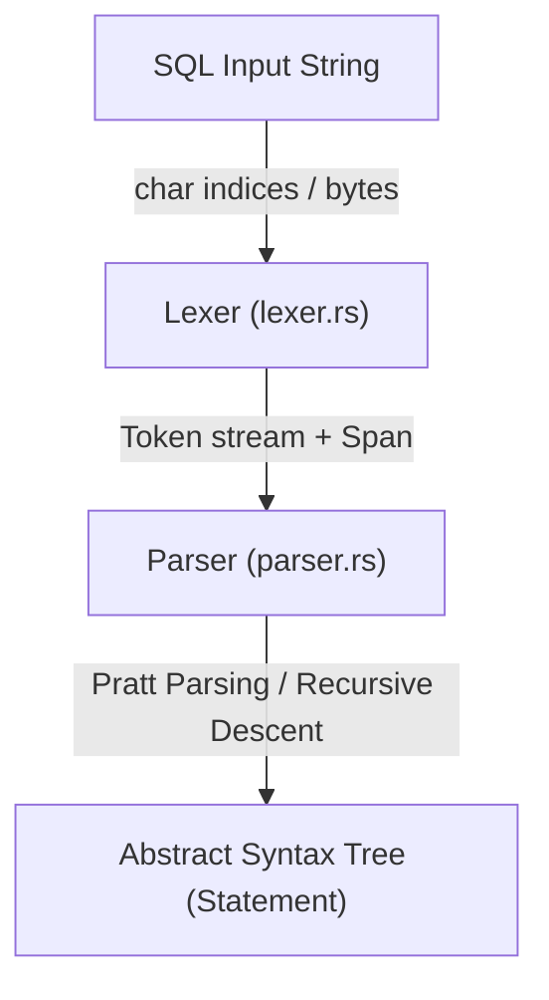

# rust_sql

[](https://crates.io/crates/rust_sql)
[](LICENSE)
[](https://github.com/musab05/rust_sql/actions)

A modular, zero-dependency, hand-written SQL lexer and parser implemented in Rust. It compiles raw SQL query strings into a fully typed Abstract Syntax Tree (AST) resembling PostgreSQL syntax.

This project is built from scratch to provide a clean, extensible foundation for SQL parsing, query analysis, and database engine implementation.

## Features

- **Hand-written Lexer**: Fast, zero-copy byte-level tokenizer with position tracking (line and column numbers) for precise error locations.
- **Pratt Parser for Expressions**: Uses Top-Down Operator Precedence (Pratt parsing) for handling complex SQL expressions, nested operators, functions, and casts with correct precedence.
- **PostgreSQL Compatibility**:
  - DDL: `CREATE TABLE` (including column constraints, default values, checks, generated columns, foreign keys, partition by, inherits, tablespaces), `CREATE INDEX`, `CREATE VIEW`, `CREATE SCHEMA`, `CREATE SEQUENCE`, `DROP`, `TRUNCATE`.
  - DML: `SELECT` (including joins, subqueries, group by, having, CTEs/with, order by, window functions, set operations like UNION/INTERSECT/EXCEPT).
  - Basic transaction control statements (`BEGIN`, `COMMIT`, `ROLLBACK`).
- **Trait-based Extensible Architecture**: The parser is split into logical modules via extension traits, making it easy to add new statement parsers.

## Architecture



## Quick Start

Add `rust_sql` to your `Cargo.toml`:

```toml
[dependencies]
rust_sql = { git = "https://github.com/musab05/rust_sql.git" }
```

### Usage Example

```rust
use rust_sql::parser::Parser;

fn main() {
    let sql = "SELECT id, name FROM users WHERE age >= 18 ORDER BY name ASC;";
    let mut parser = Parser::new(sql);

    match parser.parse() {
        Ok(statements) => {
            for stmt in statements {
                println!("{:#?}", stmt);
            }
        }
        Err(err) => {
            eprintln!("Parse error: {} at line {}, col {}", err.message, err.span.line, err.span.column);
        }
    }
}
```

## Supported Statements & Syntax

### Query Syntax (SELECT)
- Column aliases and wildcards (`SELECT a AS b, tbl.*`)
- Table Joins (`INNER`, `LEFT/RIGHT/FULL OUTER`, `CROSS`, `NATURAL`)
- Filtering and Aggregation (`WHERE`, `GROUP BY`, `HAVING`)
- CTEs / Subqueries (`WITH active_users AS (SELECT ...) SELECT ...`)
- Ordering & Pagination (`ORDER BY col DESC NULLS LAST LIMIT 10 OFFSET 5`)
- Set operations (`UNION [ALL]`, `INTERSECT [ALL]`, `EXCEPT [ALL]`)

### DDL Syntax
- `CREATE [TEMP] TABLE [IF NOT EXISTS] name (columns...)`
- `CREATE [UNIQUE] INDEX [IF NOT EXISTS] name ON table (...)`
- `CREATE [OR REPLACE] [TEMP] [RECURSIVE] VIEW name AS select`
- `CREATE SCHEMA [IF NOT EXISTS] name`
- `CREATE SEQUENCE [IF NOT EXISTS] name`
- `DROP TABLE [IF EXISTS] names... [CASCADE | RESTRICT]`
- `TRUNCATE [TABLE] names... [RESTART IDENTITY] [CASCADE | RESTRICT]`

## Project Structure

- [`src/lexer/`](src/lexer/): Hand-written lexical analyzer (tokenizer).
  - [`lexer.rs`](src/lexer/lexer.rs): Core tokenizer loop and char readers.
  - [`token.rs`](src/lexer/token.rs): Token classifications and Span representation.
- [`src/ast/`](src/ast/): Struct and Enum definitions representing the SQL syntax trees.
  - [`statement.rs`](src/ast/statement.rs): Main `Statement` enum.
  - [`expression/`](src/ast/expression/): Operator and expression nodes (`Expr`).
- [`src/parser/`](src/parser/): Pratt & Recursive-descent parser implementation.
  - [`parser.rs`](src/parser/parser.rs): Main Parser shell.
  - [`expression.rs`](src/parser/expression.rs): Pratt expression parser.
  - [`table.rs`](src/parser/table.rs): `CREATE TABLE` and table constraint parser.

## License

This project is licensed under the Apache License, Version 2.0. See the [LICENSE](LICENSE) file for details.
